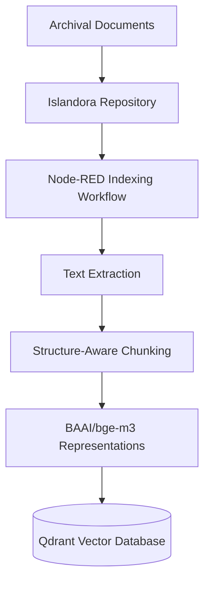
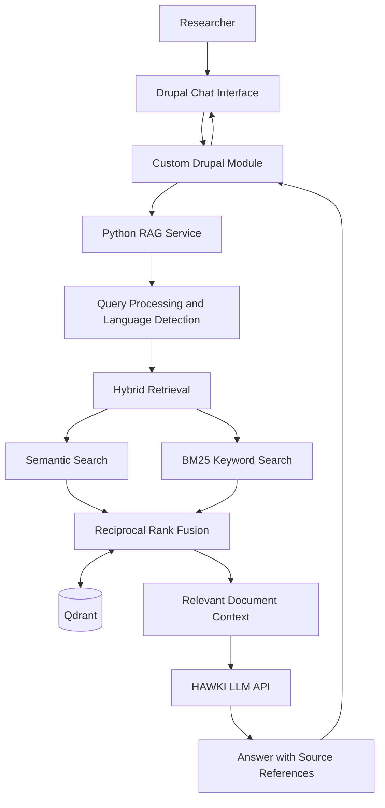

# System Architecture

## 1. Document Indexing Workflow

```mermaid
flowchart TD
    A[Archival Documents] --> B[Islandora Repository]
    B --> C[Node-RED Indexing Workflow]
    C --> D[Text Extraction]
    D --> E[Structure-Aware Chunking]
    E --> F[BAAI/bge-m3 Representations]
    F --> G[(Qdrant Vector Database)]
```

## 2. Question Answering Workflow

```mermaid
flowchart TD
    A[Researcher] --> B[Drupal Chat Interface]
    B --> C[Custom Drupal Module]
    C --> D[Python RAG Service]
    D --> E[Query Processing and Language Detection]
    E --> F[Hybrid Retrieval]
    F --> G[Semantic Search]
    F --> H[BM25 Keyword Search]
    G --> I[Reciprocal Rank Fusion]
    H --> I
    I <--> J[(Qdrant)]
    I --> K[Relevant Document Context]
    K --> L[HAWKI LLM API]
    L --> M[Answer with Source References]
    M --> C
    C --> B
```